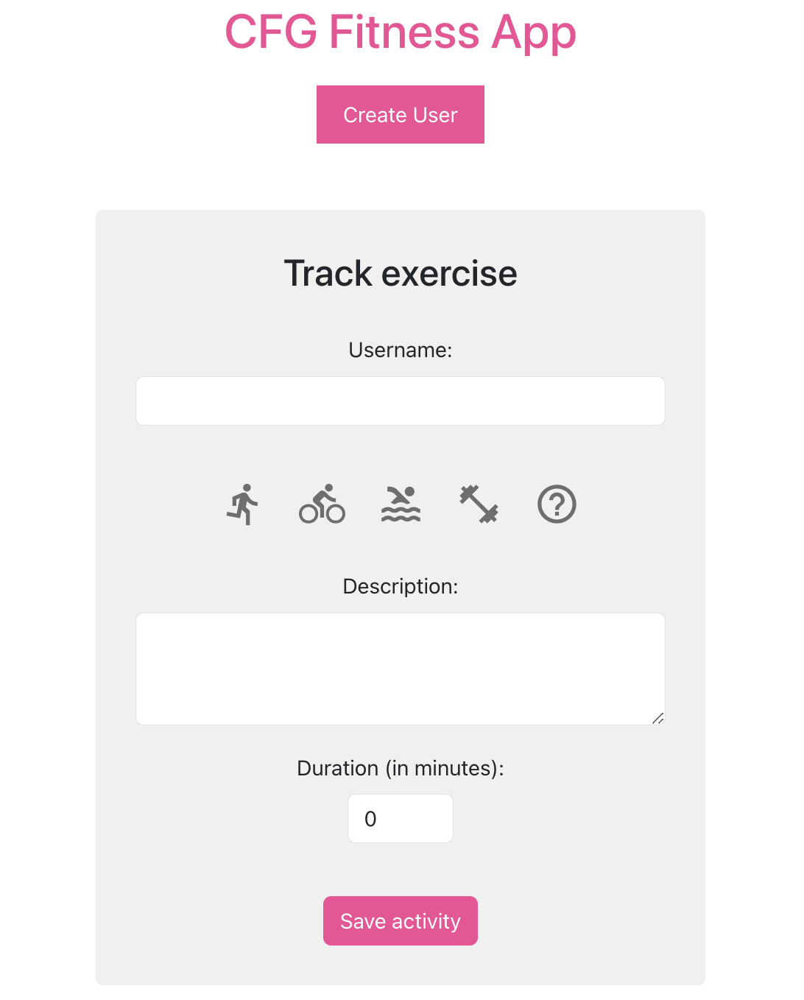

# MLA Fitness App 

A simple and interactive fitness tracking application built with multiple microservices and programming languages. This application allows users to track their exercises and monitor their progress over time.

The Activity Tracking functionality uses the MERN stack (MongoDB, Express.js, React, Node.js), the Analytics service uses Python/Flask (tbc) and the Authentication Microservice using Java.

  

## Current Features

- User registration for personalized tracking
- Log various types of exercises with descriptions, duration, and date
- Interactive UI with Material-UI components
- Real-time data persistence with MongoDB

## Prerequisites

- Node.js
- MongoDB
- npm or yarn

## Local Development

### Clone the repository

```sh
git clone git@github.com:CodeFirstGirls/MLA-pilot.git
cd MLA-Pilot
```

### Building with Docker

```sh
docker-compose up
```

## Local Development without using Docker-Compose

#### Check needed packages are installed:
```sh
sh .devcontainer/check-installation.sh 
```

#### spin up MongoDB:
```
docker run --name mymongo -d -p 27017:27017 -v mongodbdata:/data/db mongo:latest
```

#### Running Node.js Activity Tracker

```sh
cd activity-tracking
npm install
nodemon server
```

#### Running Flask application
```sh
cd analytics
flask run -h localhost -p 5050
```

#### Running Java application
```sh
cd authservice
./gradlew clean build
./gradlew bootRun
```

#### Start the Frontend 

```sh
cd frontend
npm install
npm start
```

### Connect to MongoDB

```
mongosh -u root -p cfgmla23 --authenticationDatabase admin --host localhost --port 27017
```

show registered activities:
```
db.exercises.find()
```

show registered users:
```
db.users.find()
```

## Deployment
The application is containerized using Docker and can be deployed on any platform that supports Docker containers. For AWS deployment, a GitHub Actions pipeline is configured for CI/CD.